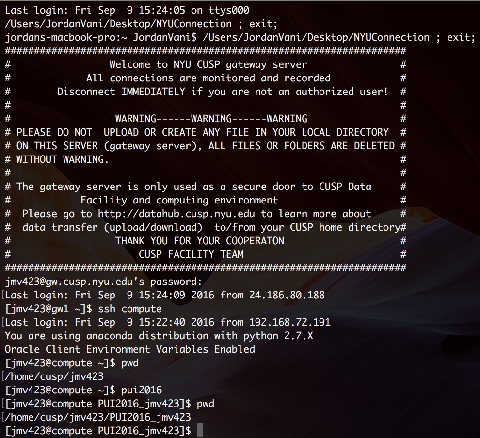

#HW1_jmv423
Jordan Vani (09/09/206)

###Assignment 1: Familiarize with GitHub
See https://github.com/jvani/gittest_jvani

1. Created a repo and file.
2. Fixed merge conflict.
3. Forked repos from Ben Miller, Ian Wright, and Ian Stuart.
4. Merged both of their pull requests into my file.

###Assignment 2: Set up environmental variable and alias
1. To set up the environmental variable, I logged into compute and added the PUI2016 variable and pui2016 alias my .bash_profile in nano. 
2. After saving and exiting nano I reloaded my .bash_profile by using:
  ```
	. .bash_profile 
	```

Below is a preview of my edited .bash_profile:	

	

Below is a working example of pui2016: 




###Assigment 3
See PUI2016_jmv423/HW1_jmv423/HW1_3_jmv423.ipynb

1. Generated one reproducible 2x100 array of random numbers.
2. Produced 50 2x100 arrays with the mean increasing 0.25xi for each array 0:50.
3. Modified the 50 arrays so the mean of the x axis increased by 0.25(i) and the mean of the y axis increased by 0.5(i).
4. Plotted both sets of 50x2x100 arrays.

###Work Breakdown
####Assignment 1
Jordan Vani created repo & .txt file, resolved merge conflict, forked Ben Miller's, Ian Wright's, and Ian Stuart's repo, merged their pull requests to my repo. Ben Miller, Ian Wright, and Ian Stuart forked my repo and accepted my pull requests.
####Assignment 2
All work completed by Jordan Vani.
####Assignment 3
All work completed by Jordan Vani.

