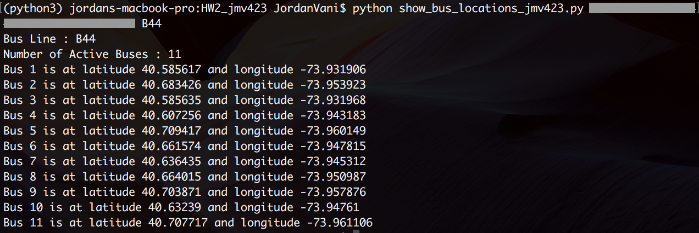

#HW2_jmv423
Jordan Vani (09/18/206)

###Assignment 1:  tracking each vehicle for a line
See: https://github.com/jvani/PUI2016_jmv423/blob/master/HW2_jmv423/show_bus_locations_jmv423.py
#####Note: Script was written to be used in Python 3.5.1
1. ```[Lines 9:11]``` Import required modules and subpackages (sys, json, and urllib.request).
2. ```[Lines 15:16]``` When accessed through the terminal via "python show_bus_location_jmv423.py xxxx-xxxx-xxxx-xxxx-xxxx \<BUS_LINE>" a list of system argument variables is created deliminated by spaces. The list items are assigned to local variables. The list items correspond to the system variables as follows:
    1.  ```sys.argv[0] = show_bus_location_jmv423.py```
    2.  ```sys.argv[1] = userkey = xxxx-xxxx-xxxx-xxxx-xxxx```
    3.  ```sys.argv[2] = busnum = \<BUS_LINE>```
3. ```[Line 18]``` The local variable 'url' is set to access the MTA bustime api by concatenating the base url with userkey and busnum variables.
4. ```[Lines 21:24]``` The MTA bustime api is accessed, decoded, formatted from json, and assigned to the local variable 'data'.
    1. ```response = ulr.urlopen(url)``` Pings the 'url' variable and returns the response.
    2. ```charset = response.info().get_content_charset()``` Returns the character set utilized in the response and assigns the string to a local variable.
    3. ```data = response.read().decode(charset)``` Decodes the response using the defined character set and assigns the return to 'data'.
    4. ```data = json.loads(data)``` Reformats the json data to a python dictionary object and assigns it to 'data'.
5. ```[Lines 27:32]``` Extracts, formats, and prints output for each bus.

#####Example:
	

####Work Breakdown
All code written by Jordan Vani. Syntax and design reviewed with Francis Ko, Shay Lehmann, and Ian Stuart.

###Assignment 2: next stop information
See: https://github.com/jvani/PUI2016_jmv423/blob/master/HW2_jmv423/get_bus_info_jmv423.py

####Work Breakdown
All code written by Jordan Vani. Syntax and design reviewed with Francis Ko, Shay Lehmann, and Ian Stuart.
