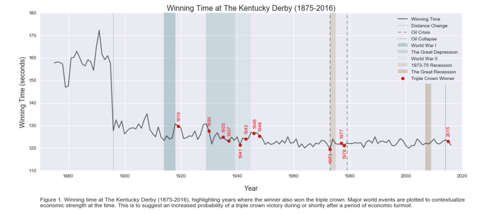

# Peer Review for jmv423  - hw7 plot
 Reviewed by: Christian Rosado (cor215)  
 
 Plot Author: jmv423  
 Github Repository: jmv423  
 
### plot 
 
 
## Review
### Data processing part for the plot
 Very nice data set. I don't know much about derbies but, your plot defined it for me pretty well. 
 
### Plot Evaluation- Clarity, Aesthetic, and Honesty
 Your plot is very detailed. I like that you chosed to make a time series plot. Very descriptive and you can clearly see the change over time.
 
 The only thing I would suggest is making the red data points a little bigger.
 
 Nice work! 
